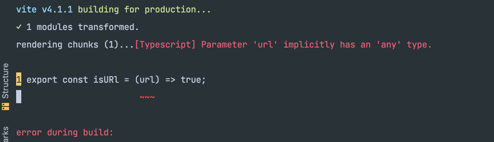

Problem: 
Using rollup-plugin-ts with vite for seamless types generation is not working with ts strict mode

- `tsc` works fine without any message
- `rollup -c` work fine and build correctly
- `vite build` fails with 

